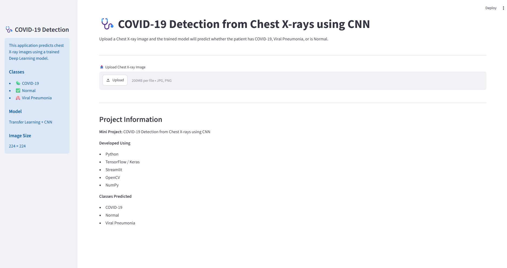
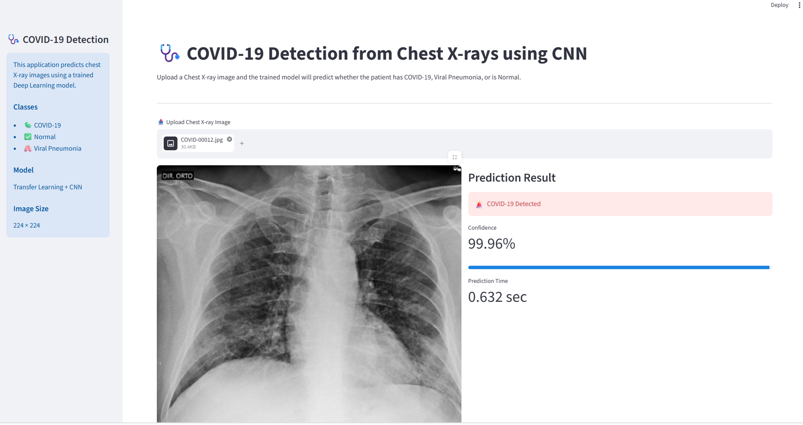
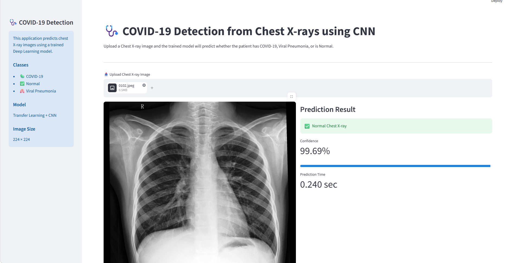
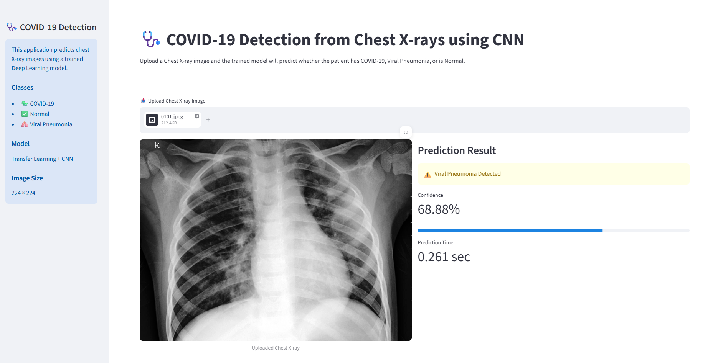

# 🩺 COVID-19 Detection from Chest X-ray Images using Deep Learning

## 📌 Overview

This project implements a **Deep Learning-based COVID-19 detection system** that classifies chest X-ray images into one of three categories:

* COVID-19
* Normal
* Viral Pneumonia

The project compares multiple Convolutional Neural Network (CNN) architectures, including a custom CNN, VGG16, ResNet50, and a Hyperparameter Tuned CNN. The best-performing model is deployed using **Streamlit** to provide an easy-to-use web interface for image classification.

---

## 🎯 Objectives

* Develop a CNN model for chest X-ray image classification.
* Compare multiple deep learning architectures.
* Improve performance using transfer learning and hyperparameter tuning.
* Evaluate models using standard classification metrics.
* Deploy the best model as a Streamlit web application.

---

## 📂 Dataset

**Dataset Name:** COVID-19 Image Dataset

**Source:** https://www.kaggle.com/datasets/pranavraikokte/covid19-image-dataset

### Classes

* COVID-19
* Normal
* Viral Pneumonia

---

## 🛠️ Technologies Used

* Python
* TensorFlow / Keras
* OpenCV
* NumPy
* Pandas
* Matplotlib
* Seaborn
* Scikit-learn
* Keras Tuner
* Streamlit
* VS Code
* Git & GitHub

---

## 📁 Project Structure

```text
covid19-chest-xray-cnn/
│
├── archive/
│   └── Covid19-dataset/
│
├── images/
│   ├── home.png
│   └── result.png
│
├── models/
│   └── final_covid_model.keras
│
├── covid_detection.ipynb
├── app.py
├── requirements.txt
├── README.md
└── .gitignore
```

---

## ⚙️ Data Preprocessing

* Loaded chest X-ray images from three classes.
* Resized all images to **224 × 224** pixels.
* Normalized pixel values to the range **0–1**.
* One-hot encoded class labels.
* Split the dataset into training, validation, and testing sets.

---

## 📊 Exploratory Data Analysis

The following analyses were performed:

* Class distribution visualization
* Sample chest X-ray images
* Pixel intensity distribution
* Image shape verification

---

## 🤖 Models Implemented

### 1. Basic CNN

* Conv2D
* MaxPooling2D
* Batch Normalization
* Dropout
* Dense Layers

### 2. VGG16 Transfer Learning

* Pre-trained ImageNet weights
* Frozen convolutional layers
* Custom classifier head
* Fine-tuning

### 3. ResNet50 + Data Augmentation

* ImageDataGenerator
* Transfer Learning
* Global Average Pooling
* Dense classifier

### 4. Hyperparameter Tuned CNN

Optimized using **Keras Tuner**.

Hyperparameters tuned:

* Number of filters
* Dense units
* Dropout rate
* Optimizer

---

## 📈 Model Performance

| Model              | Train Accuracy | Test Accuracy | F1 Score |    ROC-AUC | Model Behavior         |
| ------------------ | -------------: | ------------: | -------: | ---------: | ---------------------- |
| Basic CNN          |         91.50% |        31.82% |     0.27 |     0.5488 | High Overfitting       |
| VGG16              |         97.50% |        90.91% |     0.91 |     0.9953 | Low Overfitting        |
| ResNet50           |         41.50% |        46.97% |     0.36 |     0.8537 | Underfitting           |
| **Best Tuned CNN** |    **100.00%** |    **95.45%** | **0.95** | **0.9949** | **Slight Overfitting** |

---

## 🏆 Best Model

The **Hyperparameter Tuned CNN** achieved the best overall performance.

**Results:**

* **Test Accuracy:** 95.45%
* **F1 Score:** 0.95
* **ROC-AUC Score:** 0.9949

The trained model is saved as:

```text
models/final_covid_model.keras
```

---

## 💻 Streamlit Web Application

### Features

* Upload a chest X-ray image
* Predict the disease category
* Display confidence score
* Show prediction probabilities for all classes

---

## 🚀 Installation

Clone the repository:

```bash
git clone https://github.com/your-username/covid19-chest-xray-cnn.git
```

Navigate to the project directory:

```bash
cd covid19-chest-xray-cnn
```

Install the required packages:

```bash
pip install -r requirements.txt
```

---

## ▶️ Run the Application

```bash
streamlit run app.py
```

If Streamlit is not recognized:

```bash
python -m streamlit run app.py
```

---

## 📦 Requirements

* Python 3.10+
* TensorFlow
* Streamlit
* NumPy
* Pandas
* OpenCV
* Pillow
* Matplotlib
* Seaborn
* Scikit-learn
* Keras Tuner

---

## 📸 Application Screenshots

### 🏠 Home Page



---

### 🦠 COVID-19 Prediction



---

### 🫁 Normal Prediction



---

### 🤒 Viral Pneumonia Prediction



---

## 🔮 Future Improvements

* Increase dataset size for better generalization.
* Train EfficientNet and DenseNet models.
* Add Grad-CAM visualization for model explainability.
* Deploy the application on Streamlit Community Cloud.
* Improve the user interface and add batch image prediction.

---

## 👨‍💻 Author

**Bhushan C. Mandekar**

Data Science, Machine Learning & AI Enthusiast

**Currently Pursuing:** Advanced Certification in Data Science, Machine Learning & AI


---

## ⭐ Support

If you found this project useful, please consider giving it a ⭐ on GitHub.

---

## 📄 License

This project is developed for educational and learning purposes.
